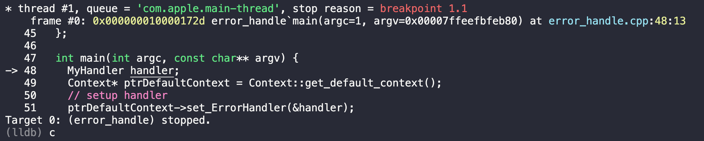
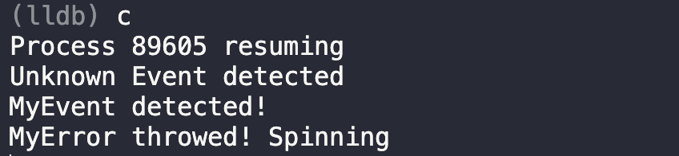
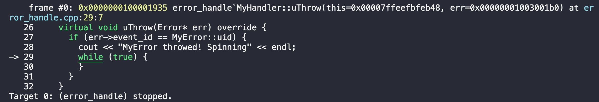

# Error Handling in `uTensor`

In this tutorial, we will learn how to catch and handle errors/events in `uTensor`.

We will implement our own handler, `MyHandler`, which will spin on errors/events of specific type. You can find its implementation in [`error_handle.cpp`](erro_handle.cpp).

## Basics of Handler in `uTensor`

To implement a handler, you must:

1. inherite `ErrorHandler`, which is declared in `errorHandler.hpp`
2. (optional) override `uThrow` method, which will be invoked whenever an error has been throwed with `Context::throwError`
3. (optional) override `notify` method, which will be invoked whenever an event has been notified with `Context::notifyEvent`

## Running Example with Debuggers

### Running with `lldb`

Running following commands in `lldb` console:

```
(lldb) file tutorials/error_handling/error_handle
(lldb) b main
(lldb) run
```

You should see:



Enter `c` to continue running:



The process spins because of an infinite loop in our handler. You can press `ctrl+C` to stop the process and you will see:



At this point, you can do debugging in your program using commands such as `bt` for back tracing, `up` to go to upper function frame, `f` for printing current frame, ...etc 